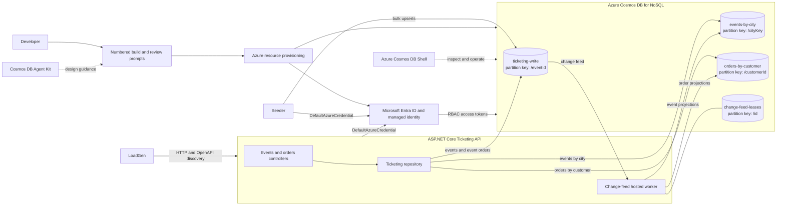

# Ticketing API Demo

This repository builds a live event ticketing API on Azure Cosmos DB through a sequence of
prompts. The finished system demonstrates keyless Azure authentication, repeatable
infrastructure, deterministic test data, a .NET REST API, workload generation, and iterative
Cosmos DB design reviews.

The prompts describe what to build, not how to build it. That deliberate latitude makes the
repository a before-and-after harness: run the same prompts with and without Cosmos DB design
guidance, then use LoadGen to measure the difference in request units and latency.

## Tools used

- [Cosmos DB Agent Kit](https://aka.ms/azurecosmosdb-agent-kit) provides tools and guidance
  for building AI-assisted workflows with Azure Cosmos DB.
- [Azure Cosmos DB Shell](https://github.com/Azure/CosmosDBShell) is a command-line interface
  for interacting with Azure Cosmos DB through intuitive, Bash-like commands, with optional
  Model Context Protocol (MCP) server support for AI-powered automation.

## Prerequisites

Install and configure these tools before starting prompt 01:

- **Git** to clone the repository:

  ```powershell
  git clone https://github.com/jaydestro/ticketapi.git
  ```

- **Visual Studio Code** with **GitHub Copilot Chat** and access to an agent-capable Copilot model.
- The [**Cosmos DB Agent Kit**](https://aka.ms/azurecosmosdb-agent-kit) for the guided review.
- **.NET SDK 10.0.302 or later**. The API, Seeder, LoadGen, and tests target `net10.0`.
- **PowerShell 7** (`pwsh`). The included launcher and validation commands use PowerShell.
- **Azure CLI** with the **Bicep CLI** available through `az bicep`. Sign in interactively with
  `az login`, select the intended subscription, and verify it before provisioning anything.
- **A live Azure subscription**. The comparison requires request-unit charges from Azure Cosmos
  DB; the emulator is not a substitute for this workflow.

The signed-in Azure identity must be able to:

- Create a resource group, user-assigned managed identity, Azure Cosmos DB for NoSQL account,
  database, and containers in the selected subscription.
- Run subscription-scope deployments and deployment what-if operations.
- Create Cosmos DB data-plane role assignments for itself and the managed identity.
- Read and write items through Microsoft Entra ID after normal RBAC propagation.

`Contributor`-equivalent resource permissions plus permission to create the Cosmos DB data-plane
role assignments satisfy the workflow. In a restricted subscription, ask an administrator to
grant the missing capability or perform the role-assignment step. Do not continue with a different
subscription or identity merely to bypass a permission failure.

The Azure Cosmos DB Shell is optional for the numbered workflow, but useful for inspecting the
result. Node.js is not required by the .NET projects; install npm dependencies only when using the
optional root Azure MCP package directly.

### Preflight check

Run these commands from PowerShell before opening prompt 01:

```powershell
git --version
dotnet --version
pwsh --version
az version
az bicep version
az login
az account show --output table
```

Confirm that `.NET` reports `10.0.302` or later, `pwsh` is version 7 or later, and
`az account show` lists the subscription you intend to use. Keep the repository-root
`appsettings.json` uncommitted; prompt 01 generates it with environment-specific resource values.

## Architecture

The diagram shows the completed, optimized implementation under `examples/after`. The
`examples/before` project preserves the `/id`-partitioned events and orders baseline used for
LoadGen comparisons.



## Build sequence

Run the numbered prompts in order.

### 01 - Create Cosmos DB and configure Entra ID

[01-create-cosmos-entra.md](Docs/prompts/01-create-cosmos-entra.md) creates the Azure foundation:

- Subscription-scope Bicep infrastructure
- A resource group and user-assigned managed identity
- A serverless Azure Cosmos DB for NoSQL account with key authentication disabled
- A database and `/id`-partitioned events and orders containers
- Cosmos DB data-plane RBAC for local development and the hosted application
- A generated root `appsettings.json` based on `appsettings.json.example`

### 02 - Seed ticketing data

[02-seeder.md](Docs/prompts/02-seeder.md) builds and runs the existing Seeder to create a
deterministic workload:

- 5,000 events
- 250,000 customer orders
- A deliberately skewed hot event for scale and query testing
- Post-run validation of counts, skew, RU consumption, and elapsed time

Deterministic IDs and upserts make the seed operation repeatable without increasing document
counts.

### 03 - Build the API

[03-app-build.md](Docs/prompts/03-app-build.md) creates the .NET 10 ASP.NET Core Web API over
the provisioned and seeded Cosmos DB data. It adds:

- Event creation and lookup endpoints
- Upcoming-event and city queries
- Ticket purchasing and inventory updates
- Customer and event order queries
- API-local models, repositories, controllers, and OpenAPI
- Keyless access through `DefaultAzureCredential`

### 04 - Review through four lenses

Capture a baseline LoadGen run against the API created in prompt 03. Then install the Azure
Cosmos DB Agent Kit:

```powershell
npx skills add AzureCosmosDB/cosmosdb-agent-kit
```

Start a fresh Copilot agent session so the newly installed guidance is available.
[04-four-lens-prompts.md](Docs/prompts/04-four-lens-prompts.md) then reviews the existing API,
finds issues through four lenses, and repairs them. Run each prompt on its own and let its fixes
finish before continuing:

1. Data model and partition key
2. RU efficiency
3. Indexing policy
4. SDK use and maintainability

A final repair prompt applies Cosmos DB best practices to the API code. Repeat the baseline
LoadGen settings after the repairs to quantify the result.

## Supporting projects

### Seeder

`Seeder` generates reproducible event and order documents with a controlled traffic skew. It
also reports total request units and elapsed time for the bulk operation.

### LoadGen

`LoadGen` drives concurrent traffic against the completed API and discovers its routes through
OpenAPI. The default comparison profile is read-only and repeats a fixed set of query shapes,
so two implementations can be measured against each other; the mixed profile adds writes and
periodic purchase bursts. Both report per-operation request rate, status counts, latency
percentiles, and Cosmos DB request-unit consumption on a live dashboard. Use
[Docs/loadgen.md](Docs/loadgen.md) to run it through the included PowerShell launcher.

## Shared configuration

`appsettings.json.example` defines the required Cosmos DB settings and placeholders for the
API's authentication authority and audience. Prompt 01 creates the ignored root
`appsettings.json`, and `Directory.Build.targets` shares it with every project. No
credentials or account keys belong in the repository.
